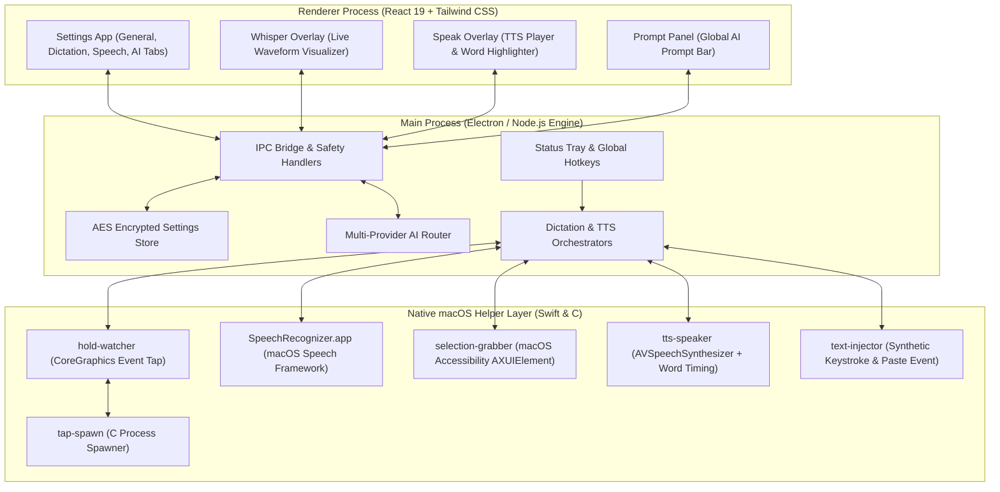
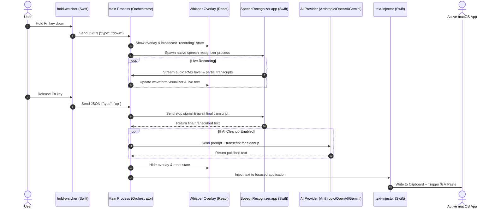
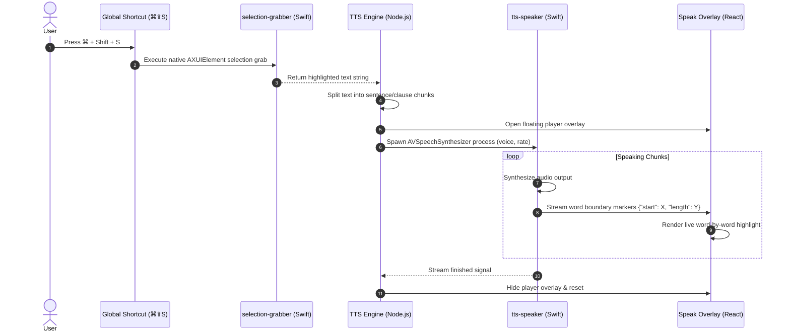
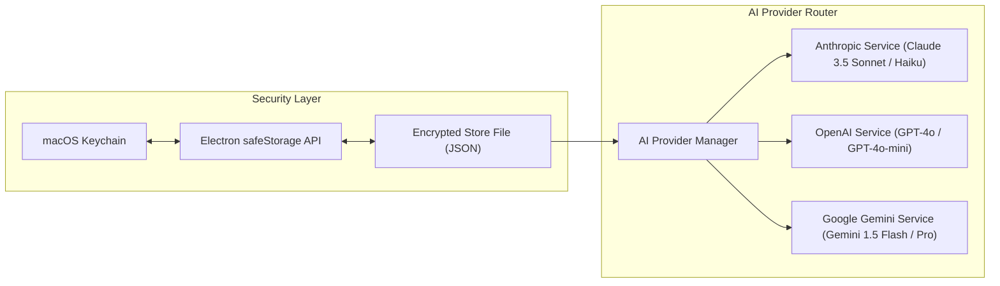

# VibeVoice

A native macOS desktop launcher for voice dictation, text-to-speech, and quick AI prompts. Built with Electron, Vite, React 19, TypeScript, and native Swift/C helpers.

Created by **Abuzar Khan**.

---

## 🚀 Key Features

- **🎙️ Instant Voice Dictation (STT)**: Hold the `Fn` key (or custom hotkey), speak, and release. VibeVoice transcribes your speech locally/natively and automatically pastes the text into your currently focused text box.
- **✨ Optional AI Cleanup Pass**: Automatically routes raw dictation transcripts through your default AI model (Anthropic Claude, OpenAI GPT, or Google Gemini) to fix grammar, remove filler words ("um", "uh"), and format capitalization before pasting.
- **🔊 Text-to-Speech (TTS) with Word Highlighting**: Highlight any text on your Mac and press `⌘ + Shift + S`. VibeVoice reads the text aloud using native `AVSpeechSynthesizer` with a floating player overlay and real-time word-by-word highlighting.
- **🤖 Global AI Prompt Bar**: Press `⌘ + Shift + P` from any application to summon a floating AI prompt launcher to ask questions, transform text, or generate code on the fly.
- **🔐 Encrypted Key Storage**: API keys are securely encrypted on disk using native macOS Keychain encryption via Electron `safeStorage`.

---

## 🏗️ Architecture & Component Design

### 1. High-Level System Architecture



---

### 2. Voice Dictation & AI Cleanup Sequence



---

### 3. Text-to-Speech (TTS) Flow



---

### 4. Multi-Provider AI Architecture & Key Security



---

## 🛠️ Technology Stack

- **Framework**: Electron 39 + Vite 7 + React 19
- **Languages**: TypeScript 5, Swift 5, C (Clang)
- **Styling**: Vanilla CSS, Tailwind CSS v4, Lucide Icons, Radix UI
- **Native OS APIs**: CoreGraphics `CGEventTap`, macOS Speech Framework, `AVSpeechSynthesizer`, Accessibility `AXUIElement`
- **Build System**: `electron-vite`, `electron-builder`, `esbuild`

---

## 💻 Development & Building

### Requirements
- **OS**: macOS (Apple Silicon or Intel)
- **Node.js**: v20+
- **Package Manager**: `pnpm` (v10+)
- **Build Tools**: Xcode Command Line Tools (`clang`, `swiftc`)

### Quick Start

```sh
# 1. Clone & Install dependencies
git clone https://github.com/abuzarkhan1/VibeVoice.git
cd VibeVoice
pnpm install

# 2. Start native compilation and development server
pnpm dev

# 3. Run type-checking
pnpm typecheck

# 4. Build native binaries & production bundle
pnpm build

# 5. Package macOS Application (.dmg / .app)
pnpm build:mac
```

---

## 🔒 macOS System Permissions

VibeVoice requires three macOS permissions to operate as a desktop utility:
1. **Accessibility** (`System Settings → Privacy & Security → Accessibility`): Required to detect `Fn` hold events and paste text into external apps.
2. **Microphone** (`System Settings → Privacy & Security → Microphone`): Required for voice dictation audio capture.
3. **Speech Recognition** (`System Settings → Privacy & Security → Speech Recognition`): Required for native macOS speech-to-text.

---

## 📄 Author & License

Created by **Abuzar Khan**. All rights reserved.
